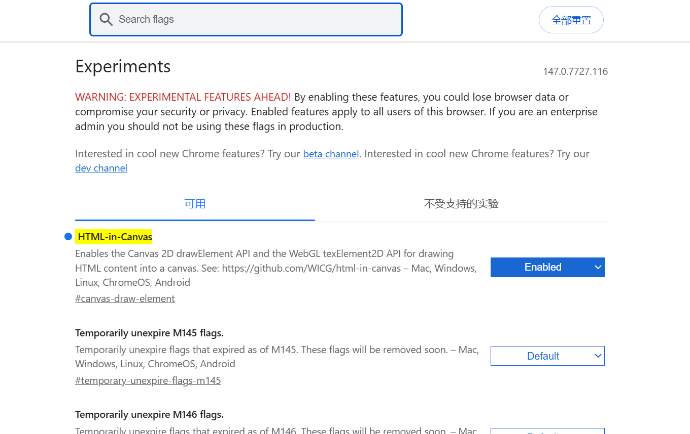
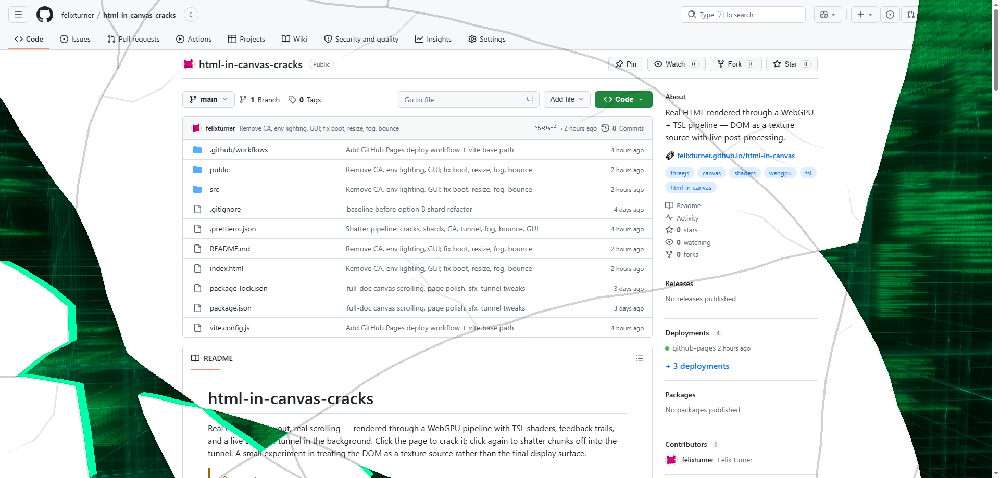
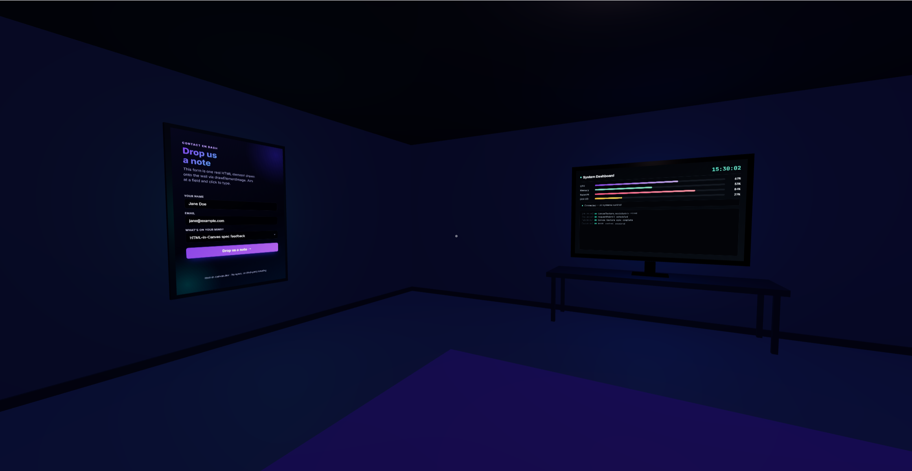
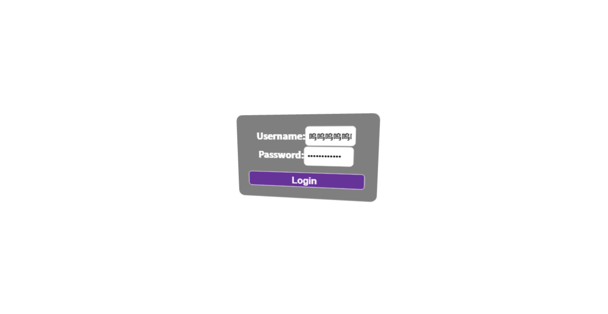

# HTML in Canvas

## 🤔 为什么需要 HTML in Canvas？

传统 `canvas` 适合像素绘制，但不擅长复杂排版内容（富文本、表单、国际化文本、无障碍语义）。
`WICG/html-in-canvas` 的目标是：**把现有 HTML 渲染能力“接入”到 2D/3D canvas 管线中**，让开发者既能用 DOM 的排版能力，又能用 canvas/WebGL/WebGPU 的特效和合成能力。

> **HTML-in-Canvas 是实验性特性**，默认浏览器不开启。
> 需要访问 `chrome://flags/#canvas-draw-element` 开启
> 

### 典型场景案例

- 图表系统：坐标轴标签、多语言文本、图例如果完全手写 `canvas` 绘制，维护成本高；用 HTML 排版后再绘制进 canvas 更稳。
- 创作工具：属性面板、富文本卡片、浮层控件需要复杂布局，同时又要叠加 shader 特效。
- 游戏 UI：登录框、设置面板、任务提示要贴到 3D 场景中的模型表面。
- 导出场景：把 DOM 内容合成后导出图片/视频，降低“屏幕看起来正常、导出却错位”的风险。

### 案例

<a href="https://felixturner.github.io/html-in-canvas-cracks/">

</a>

<a href="https://html-in-canvas.dev/demos/3d-room-live-content/demo.html">

</a>

---

## 🧩 如何实现

### 1 `layoutsubtree`：入口开关

在 `<canvas>` 上加 `layoutsubtree`，表示其子元素参与布局与命中测试。
注意：这些子元素**默认不会直接显示给用户**，需要后续显式绘制到 canvas。

### 2 元素绘制 API：把 HTML 变成画布内容

- 2D: `drawElementImage(...)`
- WebGL: `texElementImage2D(...)`
- WebGPU: `copyElementImageToTexture(...)`

本质都是同一件事：把 `canvas` 的子元素快照作为像素源，画进目标上下文（2D 或纹理）。

### 3 `paint` 事件：更新时机

当子元素渲染发生变化时触发 `paint`，在该事件里执行绘制，可拿到当前帧对应内容。
若需要“即使无变化也重绘一次”，可调用 `requestPaint()`。

### 4 `captureElementImage`：跨线程扩展（可选）

主线程抓取 `ElementImage`，传给 worker，在 `OffscreenCanvas` 里绘制。
适合重特效、离屏渲染或减少主线程压力。

---

## 🧪 案例

### 环境检查

```js
console.log(typeof WebGLRenderingContext.prototype.texElementImage2D);
```

如果输出 `function`，说明环境已具备实验能力。

### 2 一个小案例

把一个真实 HTML 表单，当成纹理贴到 Three.js 的 3D 平面上。这样你就能同时得到：

- HTML 的排版和输入能力（表单、文本、样式）
- Three.js 的 3D 视角和交互能力（相机、轨道控制、材质效果）

### 3 搭建基础环境

```html
  <body>>
    <canvas
      id="canvas"
      style="position: absolute; top: 0; left: 0; width: 100%; height: 100%"
    >
    </canvas>
  </body>
  <script type="module">
    import {
      WebGLRenderer,
      Scene,
      PerspectiveCamera,
      Mesh,
      ShaderMaterial,
      PlaneGeometry,
    } from "https://cdn.jsdelivr.net/npm/three@0.184.0/+esm";
    import { OrbitControls } from "https://cdn.jsdelivr.net/npm/three@0.184.0/examples/jsm/controls/OrbitControls.js/+esm";
    const canvas = document.getElementById("canvas");

    const context = canvas.getContext("webgl2", { antialias: true });
    const renderer = new WebGLRenderer({ canvas, context, antialias: true });
    const scene = new Scene();
    const camera = new PerspectiveCamera(75, 1, 0.1, 1000);
    camera.position.z = 10;
    const controls = new OrbitControls(camera, renderer.domElement);
    controls.enableDamping = true;
    renderer.domElement.style.touchAction = "none";
    renderer.domElement.addEventListener("contextmenu", (event) =>
      event.preventDefault(),
    );

    function resize() {
      const width = canvas.clientWidth || window.innerWidth;
      const height = canvas.clientHeight || window.innerHeight;
      renderer.setSize(width, height, false);
      camera.aspect = width / height;
      camera.updateProjectionMatrix();
    }
    window.addEventListener("resize", resize);
    resize();

    const material = new ShaderMaterial({
      uniforms: {
        uMap: { value: 0 },
      },
      vertexShader: `
        varying vec2 vUv;
        void main() {
          vUv = uv;
          gl_Position = projectionMatrix * modelViewMatrix * vec4(position, 1.0);
        }
      `,
      fragmentShader: `
        precision highp float;
        uniform sampler2D uMap;
        varying vec2 vUv;
        void main() {
          gl_FragColor = texture2D(uMap, vUv);
        }
      `,
    });


    const mesh = new Mesh(
      new PlaneGeometry(2,2),
      material,
    );
    scene.add(mesh);

    function animate() {
      requestAnimationFrame(animate);
      controls.update();
      renderer.render(scene, camera);
    }
    animate();
<script/>
```

### 4 改造为html in Canvas

#### 1. 在 `<canvas>` 上添加 `layoutsubtree`

```html
<canvas
  id="canvas"
  layoutsubtree
  style="position: absolute; top: 0; left: 0; width: 100%; height: 100%"
>
</canvas>
```

#### 2. 把要采样的 HTML（比如 `<form>`）放成 canvas 的直接子元素

```html
<canvas
  id="canvas"
  layoutsubtree
  style="position: absolute; top: 0; left: 0; width: 100%; height: 100%"
>
  <form action="" id="form">
    <div>Username:<input type="username" name="username" id="username" /></div>
    <div>Password:<input type="password" name="password" id="password" /></div>
    <div><input type="submit" id="submit" value="Login" /></div>
  </form>
</canvas>
```

#### 3. 创建原生 WebGL 纹理并设置采样参数

```js
const gl = renderer.getContext();
const rawElementTexture = gl.createTexture();
gl.bindTexture(gl.TEXTURE_2D, rawElementTexture);
// 纹理缩小时使用线性采样，避免文字/边缘过于锯齿
gl.texParameteri(gl.TEXTURE_2D, gl.TEXTURE_MIN_FILTER, gl.LINEAR);
// 纹理放大时同样使用线性采样，视觉更平滑
gl.texParameteri(gl.TEXTURE_2D, gl.TEXTURE_MAG_FILTER, gl.LINEAR);
// 非 2 的幂尺寸 DOM 纹理常用 CLAMP_TO_EDGE，避免边缘重复采样产生拉丝
gl.texParameteri(gl.TEXTURE_2D, gl.TEXTURE_WRAP_S, gl.CLAMP_TO_EDGE);
gl.texParameteri(gl.TEXTURE_2D, gl.TEXTURE_WRAP_T, gl.CLAMP_TO_EDGE);
// 让上传数据在 Y 方向翻转，和屏幕坐标方向对齐，避免上下颠倒
gl.pixelStorei(gl.UNPACK_FLIP_Y_WEBGL, true);
```

#### 4. 每帧调用 `gl.texElementImage2D(..., form)`，把最新 DOM 内容上传到纹理

```js
const form = document.getElementById("form");
function uploadElementToTexture() {
  gl.activeTexture(gl.TEXTURE0);
  gl.bindTexture(gl.TEXTURE_2D, rawElementTexture);
  gl.pixelStorei(gl.UNPACK_FLIP_Y_WEBGL, true);
  gl.texElementImage2D(
    gl.TEXTURE_2D,
    0,
    gl.RGBA,
    gl.RGBA,
    gl.UNSIGNED_BYTE,
    form,
  );
}
```

#### 5. 渲染 Three.js 场景，看到 HTML 内容出现在 3D 平面上

```js
function animate() {
  requestAnimationFrame(animate);

  uploadElementToTexture();
  controls.update();
  renderer.render(scene, camera);
}
animate();
```

#### 6 完整示例代码

```html
<!doctype html>
<html lang="en">
  <head>
    <meta charset="UTF-8" />
    <meta name="viewport" content="width=device-width, initial-scale=1.0" />
    <title>html in canvas with threejs</title>
    <style>
      form {
        position: absolute;
        top: 100px;
        left: 0;
        width: 200px;
        background-color: rgba(0, 0, 0, 0.5);
        padding: 20px;
        border-radius: 10px;
        color: white;
        font-size: 16px;
        font-weight: bold;
        text-align: center;
        z-index: 1000;
      }
      #username,
      #password {
        width: 70px;
        height: 20px;
        margin-bottom: 3px;
        padding: 5px;
        border-radius: 5px;
        border: 1px solid white;
      }
      #submit {
        width: 100%;
        height: 25px;
        margin-top: 10px;
        border-radius: 5px;
        border: 1px solid white;
        background-color: rebeccapurple;
        color: white;
        cursor: pointer;
      }
    </style>
  </head>
  <body>
    <canvas
      id="canvas"
      layoutsubtree
      style="position: absolute; top: 0; left: 0; width: 100%; height: 100%"
    >
      <form id="form">
        <div>Username:<input type="text" id="username" /></div>
        <div>Password:<input type="password" id="password" /></div>
        <div><input type="submit" id="submit" value="Login" /></div>
      </form>
    </canvas>

    <script type="module">
      import {
        WebGLRenderer,
        Scene,
        PerspectiveCamera,
        Mesh,
        ShaderMaterial,
        PlaneGeometry,
      } from "https://cdn.jsdelivr.net/npm/three@0.184.0/+esm";
      import { OrbitControls } from "https://cdn.jsdelivr.net/npm/three@0.184.0/examples/jsm/controls/OrbitControls.js/+esm";

      const canvas = document.getElementById("canvas");
      const form = document.getElementById("form");

      const context = canvas.getContext("webgl2", { antialias: true });
      const renderer = new WebGLRenderer({ canvas, context, antialias: true });
      const scene = new Scene();
      const camera = new PerspectiveCamera(75, 1, 0.1, 1000);
      camera.position.z = 10;
      const controls = new OrbitControls(camera, renderer.domElement);
      controls.enableDamping = true;

      function resize() {
        const width = canvas.clientWidth || window.innerWidth;
        const height = canvas.clientHeight || window.innerHeight;
        renderer.setSize(width, height, false);
        camera.aspect = width / height;
        camera.updateProjectionMatrix();
      }
      window.addEventListener("resize", resize);
      resize();

      const material = new ShaderMaterial({
        uniforms: { uMap: { value: 0 } },
        vertexShader: `
          varying vec2 vUv;
          void main() {
            vUv = uv;
            gl_Position = projectionMatrix * modelViewMatrix * vec4(position, 1.0);
          }
        `,
        fragmentShader: `
          precision highp float;
          uniform sampler2D uMap;
          varying vec2 vUv;
          void main() {
            gl_FragColor = texture2D(uMap, vUv);
          }
        `,
      });

      const gl = renderer.getContext();
      const rawElementTexture = gl.createTexture();
      gl.bindTexture(gl.TEXTURE_2D, rawElementTexture);
      gl.texParameteri(gl.TEXTURE_2D, gl.TEXTURE_MIN_FILTER, gl.LINEAR);
      gl.texParameteri(gl.TEXTURE_2D, gl.TEXTURE_MAG_FILTER, gl.LINEAR);
      gl.texParameteri(gl.TEXTURE_2D, gl.TEXTURE_WRAP_S, gl.CLAMP_TO_EDGE);
      gl.texParameteri(gl.TEXTURE_2D, gl.TEXTURE_WRAP_T, gl.CLAMP_TO_EDGE);
      gl.pixelStorei(gl.UNPACK_FLIP_Y_WEBGL, true);

      const { width, height } = form.getBoundingClientRect();
      const mesh = new Mesh(
        new PlaneGeometry(width / 10, height / 10),
        material,
      );
      scene.add(mesh);

      function uploadElementToTexture() {
        if (typeof gl.texElementImage2D !== "function") {
          console.log("请先开启 chrome://flags/#canvas-draw-element");
          return;
        }
        gl.activeTexture(gl.TEXTURE0);
        gl.bindTexture(gl.TEXTURE_2D, rawElementTexture);
        gl.pixelStorei(gl.UNPACK_FLIP_Y_WEBGL, true);
        gl.texElementImage2D(
          gl.TEXTURE_2D,
          0,
          gl.RGBA,
          gl.RGBA,
          gl.UNSIGNED_BYTE,
          form,
        );
      }

      function animate() {
        requestAnimationFrame(animate);
        uploadElementToTexture();
        controls.update();
        renderer.render(scene, camera);
      }
      animate();
    </script>
  </body>
</html>
```

渲染结果



---

## ⚠️ 使用时的硬约束与易错点

1. `layoutsubtree` 必须存在于最近一次渲染更新中。
2. 被绘制元素必须是 canvas 的**直接子元素**，必须在canvas内部。
3. 元素必须生成盒子（例如不能 `display: none`）。
4. 元素自身 CSS transform 不用于源绘制计算（但仍影响命中/可访问性），所以经常需要手动同步 transform。
5. 实验特性需浏览器开关：`chrome://flags/#canvas-draw-element`。
6. 隐私安全限制会屏蔽敏感信息（如跨域资源细节、系统偏好等）避免泄漏。

---

## 📝 总结

1. HTML-in-Canvas 的主线是：**先开入口（`layoutsubtree`） -> 再做绘制（元素到 2D/纹理） -> 最后做同步（transform 与更新时机）**。
2. 你的示例已经跑通 WebGL 路线：`texElementImage2D` 可以把表单这类 HTML 内容直接贴到 3D 场景。
3. 后续若追求更优性能与更贴近提案实践，可逐步从“每帧上传”演进到“`paint + requestPaint` 按变化上传”。
